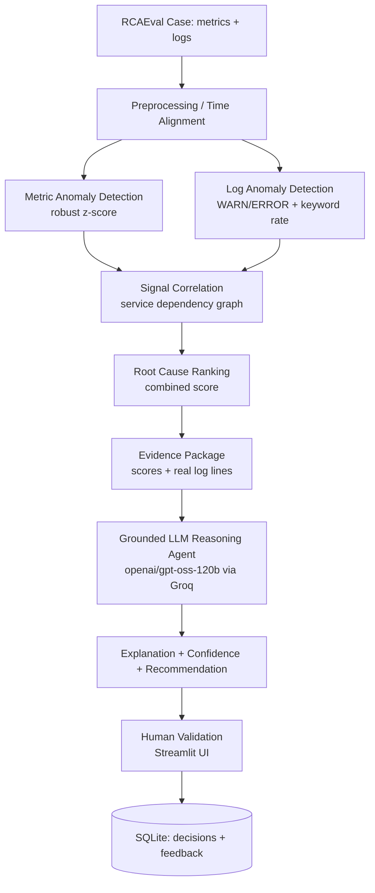

# AI Root Cause and Decision Agent

An evidence-grounded AI system for root cause analysis of microservice incidents. Given multi-source telemetry (metrics + logs) for a failure case, it detects anomalies, correlates evidence across services, ranks probable root causes, and produces an LLM-generated explanation and recommendation — grounded strictly in computed evidence, with a human-in-the-loop confirmation step.

**Status:** B.Tech Major Project — core pipeline built, evaluated (n=30 pilot), and deployed.

**Live demo:** (https://ai-root-cause-decision-agent-bu6furznjzbewlhalfunwo.streamlit.app/)(#)
**API:** `https://ai-root-cause-decision-agent-api.onrender.com` (Render free tier — sleeps after 15 min idle; first request may take ~50s to wake it)

---

## Table of Contents
- [Problem & Research Gap](#problem--research-gap)
- [Architecture](#architecture)
- [Dataset](#dataset)
- [Setup](#setup)
- [Running Locally](#running-locally)
- [Evaluation Results](#evaluation-results)
- [Limitations](#limitations)
- [Future Work](#future-work)
- [References](#references)

---

## Problem & Research Gap

Microservice incidents produce symptoms scattered across logs, metrics, and traces. Existing approaches typically handle these in isolation:

| Limitation | Source |
|---|---|
| Single-signal dependence (logs-only or metrics-only) | DeepLog (2017), HotSpot (2018), RCD (2022) |
| Root cause ranking without grounded, evidence-linked explanation | LLM‑RCA (2023) reasons from free text, not structured telemetry |
| No human validation loop | Noted as an open challenge across the field |

This project targets these three gaps directly: combining metrics + logs before ranking, grounding LLM reasoning in a structured evidence package (not free text), and closing the loop with human feedback capture.

---

## Architecture



**Stack:** pandas/numpy/scikit-learn (detection), NetworkX-style dependency mapping (correlation), Groq API (LLM reasoning), FastAPI (backend), Streamlit (frontend), SQLAlchemy/SQLite (persistence).

---

## Dataset

**[RCAEval](https://github.com/phamquiluan/RCAEval)** (Pham et al., arXiv:2412.17015) — 735 real fault-injected failure cases across three microservice systems, with ground-truth root-cause labels. We use the **RE2-SS** suite (Sock Shop, multi-source: metrics + logs), since it directly matches our multi-signal research gap.

- **Pilot subset (6 cases):** 1 per fault type (cpu, delay, disk, loss, mem, socket) — used for the deployed live demo (`data/demo/`).
- **Expanded subset (30 cases):** 5 per fault type — used for the main evaluation (Phase 11), reproducible locally via the scripts in `src/data/` (not committed to the repo due to size; see `data/README.md`).

---

## Setup

```bash
git clone https://github.com/Ayush-2205/ai-root-cause-decision-agent.git
cd ai-root-cause-decision-agent
python -m venv venv
venv\Scripts\activate          # Windows
pip install -r requirements.txt
cp .env.example .env           # then add your own GROQ_API_KEY
```

Get a free Groq API key at [console.groq.com/keys](https://console.groq.com/keys).

## Running Locally

**Terminal 1 (backend):**
```bash
uvicorn api.main:app --reload
```
**Terminal 2 (frontend):**
```bash
streamlit run app/streamlit_app.py
```
Visit `http://localhost:8501`. The bundled `data/demo/` subset (6 cases) is enough to run the full pipeline out of the box.

To reproduce the full 30-case evaluation:
```bash
python src/data/select_subset.py       # or select_subset for the expanded 30-case version
python src/data/download_cases.py
python src/preprocessing/align.py
python src/evaluation/run_full_evaluation.py
```

---

## Evaluation Results

### Pilot (n=6, 1 case per fault type)

| Approach | Top-1 | Top-3 |
|---|---|---|
| B0 (metrics only) | 5/6 | 5/6 |
| Combined (metrics + logs) | 5/6 | **6/6** |
| Grounded LLM agent | 5/6 | — |
| Ungrounded LLM baseline | **0/6** | — |

The ungrounded LLM baseline systematically overrode correct information given directly in the prompt (the alerting service) with generic architectural folk-reasoning ("it's probably the backing database"), stated with false high confidence, every time.

### Expanded evaluation (n=30, 5 cases per fault type)

| Approach | Top-1 | Top-3 |
|---|---|---|
| B0 (metrics only) | 27/30 (90%) | 29/30 (97%) |
| Combined (metrics + logs) | 27/30 (90%) | 29/30 (97%) |
| Grounded LLM agent | 27/30 (90%) | — |

**Breakdown by fault type (top-1 accuracy):**

| Fault | B0 | Combined | Grounded LLM |
|---|---|---|---|
| cpu | 100% | 100% | 100% |
| delay | 100% | 100% | 100% |
| disk | 80% | 80% | 80% |
| loss | 80% | 80% | 80% |
| mem | 100% | 100% | 100% |
| socket | 80% | 80% | 80% |

At larger n, combining logs with metrics is **statistically tied** with metrics-only on top-1 — not a clear win, contrary to our initial n=6 result. Its demonstrated value is: (1) never regresses top-1 once a threshold bug we found was fixed (see Limitations), (2) maintains strong top-3 accuracy, (3) measurably improves confidence calibration — cases with weak/conflicting evidence are correctly flagged as `medium`/`low` confidence rather than uniformly `high`.

### Groundedness (numeric-claim tracing, n=6)

Grounded agent: 0.92 average groundedness (claims traceable to the evidence package it was given). Ungrounded agent: 1.0 on this metric — but this reflects a **limitation of the metric itself**, not real reliability: the ungrounded agent fabricated causal *narratives*, not specific numbers, so a purely numeric-fabrication check doesn't catch it. See `src/evaluation/groundedness.py`.

---

## Limitations

- **Small evaluation scale.** n=30 is a real improvement over n=6 but still modest; single system (Sock Shop), fault-injected (not production) data.
- **Corroboration threshold sensitivity.** Our metrics+logs fusion initially regressed 3/30 cases due to a binary zero/nonzero corroboration check letting small, noise-level log corroboration scores fully bypass a penalty meant for uncorroborated candidates. Fixed with a minimum-magnitude threshold (`MIN_MEANINGFUL_CORROBORATION = 5.0`), verified via before/after re-evaluation. A remaining case (`re2ss_carts_socket_3`) still fails because two candidates both cross the threshold with genuinely ambiguous evidence.
- **Not a full causal-discovery reimplementation.** Our ranking is a transparent, simplified robust z-score + dependency-graph corroboration, not a reimplementation of RCD's actual causal discovery algorithm.
- **Groundedness rubric limitations.** Numeric-claim tracing has a known false-positive mode on unquoted IP addresses/ports parsed as decimals, and it cannot detect fabricated causal narratives that contain no specific numbers.
- **Deployment persistence.** The live Render deployment's SQLite database is ephemeral (resets on service restart/redeploy) — fine for demo purposes, not production use.
- **Model availability.** `llama-3.3-70b-versatile` (initially planned) was unavailable on our Groq API key; we verified available models directly via `client.models.list()` and used `openai/gpt-oss-120b` instead.

## Future Work

- Expand evaluation across RE2-OB and RE2-TT (other RCAEval systems) to test generalization beyond Sock Shop.
- Explore learned/adaptive fusion weights instead of our fixed 0.7/0.3 + threshold scheme.
- Incorporate trace data (available in RCAEval but unused here) as a third signal.
- Persistent database for the deployed version (e.g. a free-tier managed Postgres).
- Larger-scale human evaluation of explanation quality, beyond our automated groundedness rubric.

## References

1. Du, M., Li, F., Zheng, G., & Srikumar, V. (2017). DeepLog: Anomaly Detection and Diagnosis from System Logs through Deep Learning. *ACM CCS 2017*. DOI: 10.1145/3133956.3134015
2. Cheng, D., Pei, D., Zhang, S., Qu, X., & Guo, H. (2018). HotSpot: Anomaly Localization for Additive KPIs with Multi-Dimensional Attributes. *IEEE Access, 6*. DOI: 10.1109/ACCESS.2018.2804764
3. Ikram, A., Chakraborty, S., Mitra, S., Saini, S., Bagchi, S., & Kocaoglu, M. (2022). Root Cause Analysis of Failures in Microservices through Causal Discovery. *NeurIPS 2022, 35*, 31158–31170.
4. Ahmed, T., Ghosh, S., Bansal, C., Zimmermann, T., Zhang, X., & Rajmohan, S. (2023). Recommending Root-Cause and Mitigation Steps for Cloud Incidents using LLMs. *IEEE/ACM ICSE 2023*, 1737–1749. DOI: 10.1109/ICSE48619.2023.00149
5. Soldani, J., & Brogi, A. (2022). Anomaly Detection and Failure Root Cause Analysis in (Micro)Service-Based Cloud Applications: A Survey. *ACM Computing Surveys, 55*(3), 1–39. arXiv:2105.12378
6. Pham, L. et al. (2024). RCAEval: A Benchmark for Root Cause Analysis of Microservice Systems. arXiv:2412.17015.

## License
MIT — see [LICENSE](LICENSE).
